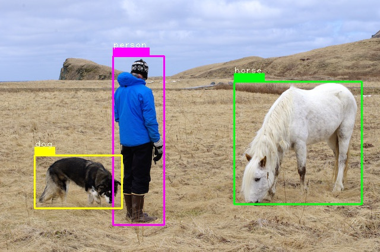

## YOLO v3 implementation With pytorch 
> this repository only contain the detection module and we don't need the cfg from original YOLOv3, we implement it with pytorch.

This repository is based on the official code of [YOLOv3](https://github.com/pjreddie/darknet) and [pytorch-yolo-v3])(https://github.com/ayooshkathuria/pytorch-yolo-v3). There's also an implementation for YOLOv3 already for pytorch, but it uses a config file rather than a normal pytorch approch to defining the network. One of the goals of this repository is to remove the cfg file.

## Requirements

* Python 3.5
* OpenCV
* PyTorch 0.4

## Installation

* Install PyTorch-0.4.0 by selecting your environment on the website and running the appropriate command.
* Clone this repository
* Compile the nms
* convert yolov3.weights to pytorch

```shell
cd YOLOv3_pytorch
./make.sh

python convert_darknet.py 
```

# Demo

```python
python demo.py --images images --save_path ./output --weights ./weights/convert_yolov3.pth

```

## Example



## References
- YOLOv3: An Incremental Improvemet (https://pjreddie.com/media/files/papers/YOLOv3.pdf)

- [Original Implementation (Darknet)](https://github.com/pjreddie/darknet)

- [pytorch-yolo-v3](https://github.com/ayooshkathuria/pytorch-yolo-v3)

- [pytorch-yolo2](https://github.com/marvis/pytorch-yolo2)